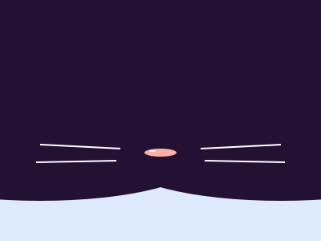

<h1>✨ Hi there! ✨</h1>

## 👽 About Me

> I started my journey in the IT world in 2018-2019, when I first wanted to try to create my own game. I didn't know anything then. Over time I have tried many things! :3

> But not AI. Somehow...

## 📚 My Stack 
### 🐱‍💻 programming language 

### 🌐 webcoding

### 👀 know some...

### ⚙ work with

## 🔥 My Stats

:3
